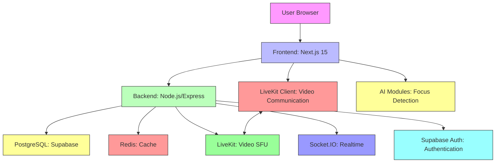

# VideoConf Platform Architecture

## Overview

VideoConf is a production-grade video conferencing platform built with a simplified microservices architecture. The platform combines all backend services into a single Node.js API for simplicity and ease of learning, while maintaining clean separation of concerns through modular code organization.

## Core Principles

1. **Simplicity**: Using a single backend service reduces operational complexity
2. **Maintainability**: Clear separation of concerns via modular routes and services
3. **Scalability**: Designed to be split into separate services when needed
4. **Security**: Industry-standard practices implemented throughout
5. **Developer Experience**: Well-documented, type-safe, and easy to extend

## System Components

### Frontend (Next.js 15)
- **Framework**: Next.js 15 with App Router
- **Styling**: TailwindCSS with shadcn/ui components
- **State Management**: React Query for server state, Zustand for client state
- **Realtime**: LiveKit React SDK for video conferencing
- **AI Integration**: Client-side focus detection using MediaPipe and Tensorflow.js

### Backend (Node.js/Express)
- **Framework**: Express.js with TypeScript
- **Database**: PostgreSQL (Supabase) with Prisma ORM
- **Realtime**: Socket.IO for chat and notifications
- **Authentication**: Supabase Auth integration
- **Video**: LiveKit server SDK for token generation and recording control
- **Moderation**: Custom service for toxicity, spam, and profanity detection
- **AI Analytics**: Endpoints for storing and retrieving focus scores

### Infrastructure
- **Containerization**: Docker and Docker Compose for local development
- **CI/CD**: Ready for deployment to Vercel (frontend) and Node.js hosting (backend)
- **Monitoring**: Health checks and logging middleware

## Data Flow

### User Authentication
1. User submits login/register form
2. Frontend sends request to `/api/auth` endpoints
3. Backend validates credentials with Supabase Auth
4. Backend creates/updates user record in public schema
5. Backend returns JWT tokens (access and refresh)
6. Frontend stores tokens and uses them for subsequent requests

### Meeting Lifecycle
1. Host creates meeting via `/api/meetings` (POST)
2. Backend creates meeting record and generates meeting token
3. Host joins meeting via `/api/meetings/:id/join` (POST)
4. Backend verifies host status and returns LiveKit token
5. Frontend uses LiveKit token to join room
6. Participants join similarly (host or waiting room logic)
7. Meeting ends when host calls `/api/meetings/:id/end` or via LeaveButton

### Video Processing
1. Frontend captures local media via `getUserMedia`
2. Media sent to LiveKit SFU (Selective Forwarding Unit)
3. LiveKit SFU forwards streams to other participants
4. Recording (if enabled) handled by LiveKit recording infrastructure
5. Focus detection runs client-side using video frames

### Chat System
1. User sends message via frontend input
2. Frontend sends to `/api/chat/:meetingId/messages` (POST)
3. Backend validates participant status and stores message
4. Backend emits message via Socket.IO to meeting room
5. All connected clients receive message in real-time
6. Message persisted to PostgreSQL

### AI Focus Detection
1. Frontend captures video frames from local video element
2. Client-side AI modules process frames (MediaPipe)
3. Individual scores (eye contact, face presence, head position) calculated
4. Composite focus score generated (0-100)
5. Score periodically sent to `/api/analytics/focus-score` (POST)
6. Backend stores/update analytics record
7. Host can retrieve analytics via `/api/analytics/meeting/:meetingId`

### Moderation
1. Frontend can check message toxicity/spam/profanity before sending
2. Host can warn/mute/kick participants via moderation endpoints
3. Actions trigger real-time notifications via Socket.IO
4. All moderation actions logged to audit table

## Security Considerations

### Authentication
- Supabase Auth handles user authentication securely
- JWT tokens used for session management
- Refresh token rotation implemented
- Passwords never stored or transmitted in plaintext

### Authorization
- Route-level authentication middleware
- Resource-level ownership checks (e.g., only host can end meeting)
- Row Level Security (RLS) policies in Supabase (to be implemented)

### Data Protection
- HTTPS enforced in production
- Input validation and sanitization (XSS, NoSQL injection)
- Rate limiting to prevent abuse
- Secure headers via Helmet.js
- SQL injection prevention via Prisma ORM

### Audit & Compliance
- AuditLog table tracks significant actions
- IP address and user agent recorded where available
- GDPR-compliant data handling practices

## Scalability Patterns

### Current (Simplified)
- Single backend service handles all requests
- Vertical scaling (increase instance size)
- Database connection pooling via Prisma
- Redis caching for frequent reads

### Future (Microservices)
- Split backend into separate services:
  - Auth Service
  - Meeting Service
  - Chat Service
  - Analytics Service
  - Moderation Service
  - Notification Service
- API Gateway for routing and cross-cutting concerns
- Message queue (e.g., RabbitMQ) for inter-service communication
- Horizontal scaling per service based on load

## Technology Choices

### Why LiveKit?
- Production-ready WebRTC SFU
- Scalable and reliable
- Excellent developer experience
- Active community and documentation
- Handles complex media routing, recording, and bandwidth adaptation

### Why Supabase?
- Open-source Firebase alternative
- PostgreSQL database with realtime capabilities
- Built-in authentication (Auth)
- Auto-generated APIs
- Easy to use with Prisma
- Generous free tier for learning

### Why Next.js 15?
- React framework with excellent performance
- App Router for improved data fetching
- Built-in image optimization
- Server-side rendering and static generation
- Excellent TypeScript support
- Vercel integration for easy deployment

### Why Prisma?
- Type-safe ORM for Node.js
- Excellent developer experience
- Automatic migrations
- Strong PostgreSQL support
- Reduces boilerplate database code

### Why Docker?
- Consistent development environments
- Easy reproduction of production setup
- Simplifies dependency management
- Ready for container orchestration (Kubernetes)

## Diagram

## Deployment Architecture

### Development
- Frontend: `npm run dev` on localhost:3000
- Backend: `npm run dev` on localhost:4000
- External Services: Supabase (managed), Redis (Docker), LiveKit (Docker)

### Production
- Frontend: Deployed to Vercel or similar platform
- Backend: Deployed to Node.js hosting (AWS, DigitalOcean, etc.)
- Database: Supabase PostgreSQL (managed)
- Cache: Redis (managed or self-hosted)
- Video: LiveKit (self-hosted or managed service)
- CDN: Vercel Edge Network or Cloudflare

## Conclusion

This architecture provides a solid foundation for a production-ready video conferencing platform that is secure, scalable, and maintainable. The simplified backend service makes it accessible for learning while preserving the ability to evolve into a full microservices architecture as the platform grows.